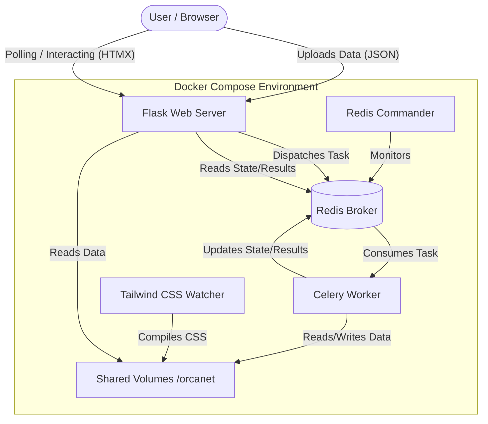

# OrcaNet

OrcaNet is a full-stack bioinformatics web application designed to analyze and visualize metagenomic data. It provides an end-to-end pipeline for uploading dataset files (JSON format), processing them through various analytical stages, and generating interactive visualizations to explore contig novelty, biological context, and clustering.

## 🏗️ Architecture overview

The application is designed with a decoupled, asynchronous architecture to handle long-running data analysis tasks without blocking the user interface.



### Components:
1. **Frontend (HTMX + Tailwind CSS)**: 
   - The UI is server-rendered using Flask templates but behaves like a single-page application (SPA) thanks to **HTMX**. HTMX handles asynchronous polling for task progress and dynamic DOM updates (using `hx-swap-oob`) without requiring a heavy frontend framework like React or Vue.
   - **Tailwind CSS** provides utility-first styling, continuously compiled during development by a dedicated Docker service.
2. **Web Server (Flask)**:
   - Handles HTTP requests, file uploads (saving them to a shared volume), and initiates background analysis tasks.
   - Serves partial HTML responses to HTMX for seamless UI updates.
3. **Task Queue (Celery)**:
   - Offloads the heavy computational data analysis (the 5-stage pipeline) from the web server. This ensures the web server remains responsive.
4. **Message Broker & State Backend (Redis)**:
   - Facilitates communication between Flask and Celery. It stores the queued tasks and the real-time progress/results of the analysis.
5. **Data Processing & Visualization (Pandas, SciPy, Plotly)**:
   - The Celery worker utilizes Python's data science stack to parse the data, perform calculations (like hierarchical clustering and distance matrices), and generate interactive JSON-based Plotly figures (Radar charts, 3D UMAPs, Wavelets).

## 🚀 Technologies Used

### Backend & Infrastructure
- **[Flask](https://flask.palletsprojects.com/)**: The core web framework routing requests and rendering templates.
- **[Celery](https://docs.celeryq.dev/)**: Asynchronous task queue for executing the heavy data analysis pipeline in the background.
- **[Redis](https://redis.io/)**: In-memory data store acting as the message broker and result backend for Celery.
- **[Docker & Docker Compose](https://www.docker.com/)**: Containerization platform ensuring consistent environments across development and production. It orchestrates the web, worker, redis, tailwind, and redis-commander services.

### Frontend
- **[HTMX](https://htmx.org/)**: Allows accessing AJAX, CSS Transitions, WebSockets, and Server Sent Events directly in HTML, enabling a reactive UI driven by the server.
- **[Tailwind CSS](https://tailwindcss.com/)**: A utility-first CSS framework for rapidly building custom user interfaces.
- **[Jinja2](https://jinja.palletsprojects.com/)**: The templating engine used by Flask to generate dynamic HTML.

### Data Science & Visualization
- **[Pandas](https://pandas.pydata.org/) & [NumPy](https://numpy.org/)**: Used for data manipulation, reading uploaded JSON datasets, and numerical operations.
- **[SciPy](https://scipy.org/)**: Used for advanced mathematical functions, specifically calculating distance matrices (`pdist`) and hierarchical clustering (`linkage`, `to_tree`) for phylogenetic tree generation.
- **[Plotly](https://plotly.com/python/)**: Used to generate complex, interactive visualizations (Radar Charts, 3D Scatter Plots, Morlet Wavelets) directly from Python, which are then rendered on the frontend.

## 🧬 Analysis Pipeline

When a user uploads a `.json` dataset, it goes through a simulated 5-stage analysis pipeline executed by Celery:

1. **Quality Control**: Filters and assesses the quality of the uploaded reads.
2. **Metagenomic Assembly**: Generates a 3D UMAP projection of assembled contigs and computes a dynamic phylogenetic tree (Newick format) using hierarchical clustering.
3. **Feature Extraction**: Extracts specific features from contigs and generates Morlet Wavelet charts based on novelty scores.
4. **Novelty Scoring**: Calculates various scores (Embedding, Homology, Wavelet, Motif, Vision Uncertainty) and generates a comprehensive Radar chart.
5. **Biological Context**: Aggregates the data, sorts by novelty, and prepares the final datasets for tabular presentation.

## 🛠️ Getting Started

### Prerequisites
- Docker
- Docker Compose

### Running the Application

1. Clone the repository and navigate to the project directory.
2. Build and start the containers using Docker Compose:
   ```bash
   docker-compose up --build
   ```
3. Access the application in your browser at `http://localhost:5000`.
4. (Optional) Access the Redis Commander UI at `http://localhost:8081` to monitor the Redis queue.

### Project Structure
- `app/`: Contains the Flask application factory, routes, and tasks.
  - `routes.py`: Defines the web endpoints and handles HTMX requests.
  - `tasks.py`: Contains the Celery background tasks and data processing logic.
  - `templates/`: Jinja2 HTML templates, including HTMX partials.
- `docker-compose.yml`: Defines the multi-container Docker environment.
- `Dockerfile`: Instructions for building the Python web/worker environments.
- `package.json` & `tailwind.config.js`: Tailwind CSS configuration and scripts.
